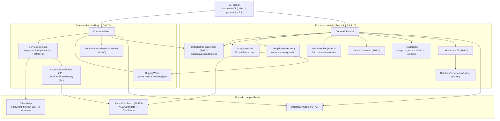
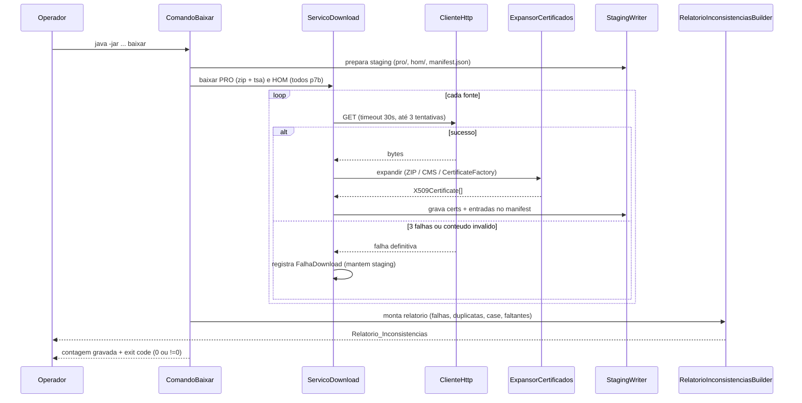

# Design Document

## Overview

Esta feature (re)implementa a ferramenta `automacao-importador` como uma **aplicação Java autônoma (standalone)** — um módulo Maven no mesmo repositório do signer, porém com **execução independente do build do signer** —, substituindo a implementação atual em Go. A ferramenta baixa e importa cadeias de certificados ICP-Brasil (produção e homologação) para o keystore BKS de destino, agora manipulando o keystore **nativamente via API do BouncyCastle** (`java.security.KeyStore` com provider `BC` e `java.security.cert.X509Certificate`), o que **elimina os subprocessos frágeis `keytool` e `openssl`** usados hoje.

A ferramenta é dividida em **dois processos independentes**, expostos como subcomandos do mesmo binário:

- **`baixar`** — baixa todas as cadeias (PRO e HOM) para uma **Staging** em disco e emite o `Relatorio_Inconsistencias`, sem tocar no keystore.
- **`persistir`** — lê a Staging e grava os certificados no keystore BKS, com deduplicação configurável, escrita atômica e o `Relatorio_Persistencia`.

Princípios que guiam a implementação:

- **Manipulação nativa do BKS.** Ler, comparar e gravar certificados usa a API `java.security.KeyStore` (`getInstance("BKS", "BC")`) e `CertificateFactory`/`CMSSignedData` do BouncyCastle. Sem `keytool`, sem `openssl`.
- **Núcleo puro separado do IO.** Toda a lógica de decisão (deduplicação, detecção de duplicatas/conflitos, cálculo de faltantes, diff do keystore, geração de aliases, decisão de gravação após falhas, decisão de exit code) fica em **classes puras** que recebem e retornam objetos de domínio (records), sem IO. Isso habilita testes unitários e property-based (jqwik). O IO (`HttpClient`, filesystem, `KeyStore`) fica em uma camada fina de adaptadores.
- **Escrita segura.** O keystore só é tocado pelo `persistir`, com escrita atômica (arquivo temporário + `Files.move(ATOMIC_MOVE)`) e backup para rollback.
- **Falhas explícitas.** Nenhuma cadeia incompleta é publicada silenciosamente; falhas alteram o exit code e os relatórios.
- **Fidelidade à ICP-Brasil.** Nenhum filtro por validade: certificados expirados são preservados.
- **Aplicação autônoma.** Empacotada como **uber-jar** (via `maven-shade-plugin`) com todas as dependências embutidas (BouncyCastle, picocli, Jackson), executável em qualquer máquina com um JRE compatível via `java -jar`, **sem depender do reactor Maven em tempo de execução**.
- **Configuração por parâmetros.** Caminho do keystore de destino, senha do keystore, URLs de origem e diretório de staging são fornecidos por **opções de CLI** (com defaults sensatos), em vez de caminhos relativos amarrados ao layout do repositório, para permitir execução fora do build.

As regras de negócio da implementação Go atual permanecem válidas: a detecção de duplicatas por serial/subject e de conflitos de case por CN (hoje em `diagnostico-cadeia.go`) é reimplementada em Java com a mesma semântica.

### Mudanças em relação ao comportamento atual

| Aspecto | Hoje (Go) | Alvo (Java/Maven) |
| --- | --- | --- |
| Linguagem/build | binário Go isolado | aplicação autônoma (uber-jar shade), módulo Maven único no mesmo repositório, executável fora do build do signer |
| Configuração | caminhos relativos fixos no código (`../chain-icp-brasil/...`) | opções de CLI: `--keystore`, `--senha`, `--staging`, `--url-*` com defaults |
| Manipulação do BKS | `keytool -importcert` (subprocesso) | `KeyStore.getInstance("BKS","BC")` + `setCertificateEntry` |
| Parsing de p7b/PEM | `openssl` (subprocesso) | `CMSSignedData` / `CertificateFactory` do BC |
| CLI | flags `-env pro\|hom` | subcomandos `baixar` e `persistir` (picocli) |
| Erros de download | `log.Printf`, execução continua | falha registrada, exit code != 0, staging preservada |
| Keystore | gerado sempre no fluxo único | só o `persistir` grava, atômico com rollback |
| Aliases | `= nome do arquivo`, sem dedup | únicos case-insensitive + dedup configurável |
| HTTP | sem timeout/retry | `java.net.http.HttpClient`, timeout 30s + até 3 tentativas |
| Staging | efêmera, apagada no fim | persistida em disco (raiz configurável via `--staging`) com `manifest.json`, consumida pelo `persistir` |

## Architecture

### Empacotamento e independência

A ferramenta é uma **aplicação autônoma**: um **módulo Maven único** `automacao-importador` (`groupId` `org.demoiselle.signer`, `artifactId` `automacao-importador`), presente no mesmo repositório do signer, mas **empacotado com o `maven-shade-plugin` como uber-jar executável** — `Main-Class` no manifest e **todas as dependências embutidas** (incluindo o provider **BouncyCastle**, além de **picocli** e **Jackson**). Isso permite rodá-la em **máquina/pipeline separado**, via `java -jar automacao-importador.jar baixar|persistir`, **sem depender do reactor Maven em tempo de execução**. Motivos:

- O uber-jar é operacionalmente autossuficiente: basta um JRE compatível na máquina de destino; nenhuma resolução de dependências, nenhum plugin `exec`, nenhum checkout do repositório é necessário para executar.
- A execução (`baixar`/`persistir`) fica desacoplada do ciclo de build do signer, evitando que a manutenção da cadeia ICP-Brasil dependa de `mvn` sobre o projeto inteiro.

**Alinhamento de versão do BouncyCastle.** O módulo **herda a versão do BouncyCastle do `parent`** (`bcmail-jdk18on` 1.80, declarado no `parent`/`bom`), garantindo que o BKS gerado seja **byte-compatível** com o que o signer consome — porém essa dependência é **empacotada dentro do uber-jar**, e não resolvida em runtime. Assim mantém-se compatibilidade de formato sem acoplar a execução ao reactor.

**Parser de CLI:** recomenda-se **picocli** para os subcomandos, flags e `--help`, pela geração automática de `--help`, validação de flags e mensagens de erro consistentes — o que atende diretamente aos Req 4 (validação de `--remover-duplicadas`) e Req 5 (ajuda). A alternativa (parsing manual de `args`) é viável mas exigiria reimplementar `--help` e validação.

**Restrição de versão de Java (a resolver na fase de tasks):** o restante do reactor está hoje pinado em Java 1.8 (`maven.compiler.source/target = 1.8`). O design depende de `java.net.http.HttpClient` (Java 11+) e `record` (Java 16+). Portanto o **módulo `automacao-importador` deve sobrescrever `maven.compiler.release`** para **Java 17+**, isolado neste módulo (o restante do reactor permanece em 1.8); o ambiente de build dispõe de JDK moderno. Caso a política do projeto exija Java 8, os `record` são substituídos por classes imutáveis equivalentes e o `HttpClient` por um cliente HTTP compatível — mas a recomendação é usar a versão moderna, isolada neste módulo.

### Componentes



Organização em pacotes Java (dentro do módulo, base `org.demoiselle.signer.importador`):

- `cli` — `ImportadorCli`, `ComandoBaixar`, `ComandoPersistir` (picocli). Camada de IO/orquestração.
- `dominio` — records e enums imutáveis (`Certificado`, `Origem`, `Manifest`, etc.). Puro.
- `nucleo` — classes puras de decisão: `Deduplicador`, `DetectorInconsistencias`, `GeradorAlias`, `CalculadoraDiff`, `DecisorGravacao`, `DecisorExitCode`, `ParserCertificado`.
- `relatorio` — `RelatorioInconsistenciasBuilder`, `RelatorioPersistenciaBuilder`. Puro.
- `io` — `ClienteHttp`, `ExpansorCertificados`, `StagingReader`, `StagingWriter`, `KeystoreBks`. Camada de IO.

### Fluxo do Processo baixar



### Fluxo do Processo persistir

```mermaid
sequenceDiagram
    participant Op as Operador
    participant PS as ComandoPersistir
    participant SR as StagingReader
    participant D as Deduplicador
    participant A as GeradorAlias
    participant K as KeystoreBks
    participant C as CalculadoraDiff
    participant RP as RelatorioPersistenciaBuilder

    Op->>PS: java -jar ... persistir --remover-duplicadas=N
    PS->>PS: valida flag (1|2; invalido -> aborta, keystore intacto)
    PS->>SR: carrega staging
    alt staging vazia
        SR-->>PS: vazio -> aborta ("rode baixar primeiro"), exit != 0
    else staging com certs
        PS->>K: snapshot ANTES (KeyStore.load do BKS atual, se existir)
        PS->>D: dedup(certs, metodo) -> mantidos + descartados + conflitos
        PS->>A: gerar aliases unicos case-insensitive -> atribuicoes
        PS->>K: escrita atomica (tmp + backup + ATOMIC_MOVE)
        alt falha na escrita
            K->>K: rollback (restaura backup)
            K-->>PS: erro -> NAO emite Relatorio_Persistencia, exit != 0
        else sucesso
            PS->>K: snapshot DEPOIS
            PS->>C: diff(antes, depois, descartados, conflitos, atribuicoes)
            C->>RP: monta relatorio
            RP-->>Op: Relatorio_Persistencia
        end
    end
    PS-->>Op: exit code (0 ou !=0)
```

## Components and Interfaces

### `ImportadorCli` / `ComandoBaixar` / `ComandoPersistir` — CLI picocli (Req 1.1, 4.1–4.3, 5, 9)
`ImportadorCli` é o comando raiz com subcomandos `baixar` e `persistir`. `ComandoPersistir` declara `@Option(names = {"--remover-duplicadas"})` com valor default `1` e validação para `{1,2}` (Req 4.1, 4.2; valor inválido é rejeitado pelo picocli antes de qualquer gravação — Req 4.3). O texto de `--help`/`-h` de `persistir` descreve o Metodo_Conservador e o Metodo_Agressivo (Req 5.1, 5.2) e o picocli exibe a ajuda sem executar a lógica (Req 5.3). Traduz o `ResultadoExecucao` em exit code via `DecisorExitCode` (Req 9).

Como aplicação autônoma, a **configuração é parametrizável por opções de CLI**, reforçando a execução independente do build: o **caminho do keystore de destino** (`--keystore`), a **senha do keystore** (`--senha`), o **diretório de staging** (`--staging`) e, quando aplicável, as **URLs de origem** (`--url-*`) são opções de CLI com **defaults sensatos**. `ComandoBaixar` aceita `--staging` e as opções de URL de origem; `ComandoPersistir` aceita `--keystore`, `--senha` e `--staging`. Nenhum caminho relativo amarrado ao layout do repositório é assumido — os defaults apenas fornecem valores convenientes quando as opções são omitidas.

### `ClienteHttp` — timeout + retry (Req 2.3, 7.6)
Usa `java.net.http.HttpClient` com `HttpRequest` configurado com `timeout(Duration.ofSeconds(30))`. Um laço de até **3 tentativas** por recurso; retorna um resultado classificado (`sucesso` com bytes, ou `falha` com motivo: timeout, status != 200, IO). Expõe uma interface injetável (`Transporte`) para permitir mock em testes de propriedade da lógica de retry.

### `ExpansorCertificados` — expansão sem subprocessos (Req 2.1)
Expande o ZIP de produção via `java.util.zip.ZipInputStream` e os arquivos `.p7b` (PKCS#7 / CMS) via `org.bouncycastle.cms.CMSSignedData` + `CertificateFactory.getInstance("X.509")`, retornando `List<X509Certificate>`. Substitui integralmente `openssl`.

### `ParserCertificado` — parsing puro (base do núcleo)
Converte um `X509Certificate` no record `Certificado`:
- `subject` = `cert.getSubjectX500Principal().getName()`
- `serial` = `cert.getSerialNumber()` (`BigInteger`, comparado como string canônica)
- `cn` = extraído do subject via `javax.naming.ldap.LdapName` (RFC 2253), procurando o RDN `CN`
- `cnNorm` = `cn.trim().toUpperCase(Locale.ROOT)` — chave case-insensitive
- `notBefore`/`notAfter` = `cert.getNotBefore()`/`cert.getNotAfter()`
- `selfSigned` = subject == issuer (`getIssuerX500Principal()`)

Função pura sobre o `X509Certificate` já carregado (a leitura de bytes é feita na camada IO).

### `DetectorInconsistencias` — detecção pura (Req 3.3, 3.4, 3.5)
Sobre `List<Certificado>`:
- `detectarDuplicatasExatas(certs)` — agrupa por `(serial, subject)`; grupos com tamanho > 1 são duplicatas exatas.
- `detectarConflitosCase(certs)` — agrupa por `cnNorm`; reporta grupos que contêm mais de uma **grafia** distinta de CN (mesmo `cnNorm`, `cn` diferente). Preserva a semântica do `diagnostico-cadeia.go` atual (ex.: "Hom" vs "HOM").
- `faltantes(esperadas, presentes)` — `esperadas \ presentes` (cadeias HOM esperadas ausentes).

### `Deduplicador` — deduplicação pura (Req 4.4–4.8, 6.4, 8.3, 8.4)
- `conservador(certs)` — remove apenas duplicatas exatas por `(serial, subject)`, mantendo uma ocorrência por identidade; **preserva** integralmente os certificados que constituem conflitos de case (Req 4.4, 4.5).
- `agressivo(certs)` — agrupa por `cnNorm`; mantém **um** por grupo: o de `notBefore` mais recente; empate no máximo → o de **menor índice de entrada** (Req 4.6, 4.7, 4.8). `notBefore` é apenas critério de desempate, nunca filtro por validade (Req 6.4). Retorna `ResultadoDedup` com mantidos, descartados por duplicata e conflitos resolvidos.

### `GeradorAlias` — aliases únicos determinísticos (Req 8.1, 8.2, 8.5)
`gerarAliases(certs)`: alias base derivado do CN (normalizado para um identificador estável). Ao colidir **case-insensitive** com um alias já atribuído, gera um alias alternativo **determinístico** (base + sufixo derivado do serial; e um contador estável se ainda colidir). Garante: mesma entrada → mesma saída; aliases finais distintos case-insensitive. Retorna `List<AtribuicaoAlias>`.

### `KeystoreBks` — snapshot, escrita atômica, rollback (Req 1.7, 8, 10.2, 10.8)
O **caminho do keystore de destino** (`path`) e a **senha** usados em todas as operações vêm das opções de CLI `--keystore` e `--senha` (com defaults), e não de um caminho fixo no código — reforçando a execução independente em máquina/pipeline separado.
- `snapshot(path)` — se o arquivo existe, `KeyStore.getInstance("BKS", "BC")` + `load(...)`, enumera `aliases()` e para cada um `getCertificate(alias)` → `List<Certificado>`; se não existe, retorna lista vazia (primeira publicação — Req 10.2).
- `gravarAtomico(atribuicoes, path)` — cria um `KeyStore` BKS/BC em memória, `setCertificateEntry(aliasFinal, cert)` por certificado, escreve com `store()` em arquivo temporário (`Files.createTempFile`), move o atual para backup, e `Files.move(tmp, path, ATOMIC_MOVE)`; em qualquer falha, restaura o backup (rollback) e propaga o erro (Req 1.7, 10.8).

### `CalculadoraDiff` — diff puro (Req 10.2–10.7)
`calcular(antes, depois, resultadoDedup, atribuicoes)` → `DiffKeystore`:
- adicionadas = `depois \ antes` por `(subject, serial)` (Req 10.2)
- removidas = `antes \ depois` por `(subject, serial)` (Req 10.3)
- descartadas por dedup (Req 10.4), conflitos resolvidos (Req 10.5), aliases renomeados (atribuições com final != original, Req 10.6)
- `inalterado = true` quando todos os conjuntos acima são vazios (Req 10.7)

### `DecisorGravacao` — decisão pura pós-falhas (Req 7.2–7.5)
`deveGravar(nFalhasDownload, temTty, respostaOperador)` → `boolean`: grava se e somente se `nFalhas == 0`, ou (`nFalhas > 0` **e** `temTty` **e** `resposta == "sim"`). Default "não"; ausência de TTY força "não" (Req 7.3, 7.5). `System.console() == null` sinaliza ausência de TTY na camada de IO que chama este decisor.

### `DecisorExitCode` — resultado → código (Req 9)
`codigo(resultado)` → `int`: `0` sse `nFalhas == 0`, senão `!= 0`; a mensagem identifica o processo (`baixar`/`persistir`) e a quantidade de falhas. A camada CLI chama `System.exit(codigo)`.

### `RelatorioInconsistenciasBuilder` / `RelatorioPersistenciaBuilder` — relatórios puros (Req 3, 10)
- `Inconsistencias(manifest)`: falhas (Req 3.2), duplicatas exatas (Req 3.3), conflitos de case (Req 3.4), HOM faltantes (Req 3.5); tudo vazio → texto explícito de "sem inconsistências" (Req 3.6).
- `Persistencia(diff)`: adicionadas/removidas (Req 10.2, 10.3), descartadas por dedup (Req 10.4), conflitos resolvidos (Req 10.5), aliases renomeados (Req 10.6); `inalterado` → texto explícito (Req 10.7). Só é construído após gravação bem-sucedida (Req 10.1, 10.8).

### `StagingReader` / `StagingWriter` — Staging em disco (Req 1.2, 1.5, 1.6, 2.5)
A **raiz da staging** usada por ambos vem da opção de CLI `--staging` (com default sensato), e não de um caminho fixo no código. `StagingWriter` grava cada certificado (DER) sob `pro/` ou `hom/` e mantém `manifest.json`. `StagingReader` lê o manifest e os certificados referenciados; se o manifest não existe ou tem `certificados` vazio, sinaliza staging vazia (Req 1.6). Nenhuma operação de staging toca o keystore (Req 1.2, 2.2).

## Data Models

Modelos de domínio como **Java records** (imutáveis) e enums, no pacote `dominio`. Assinaturas:

```java
public enum Origem { PRO, HOM }

/** Certificado normalizado extraído de um X509Certificate. Usado por todo o núcleo puro. */
public record Certificado(
        String subject,        // cert.getSubjectX500Principal().getName()
        BigInteger serial,     // cert.getSerialNumber()
        String cn,             // CN extraído do subject (grafia original)
        String cnNorm,         // cn.trim().toUpperCase(Locale.ROOT) — chave case-insensitive
        Instant notBefore,     // cert.getNotBefore() (critério de desempate; nunca filtro)
        Instant notAfter,      // cert.getNotAfter() (apenas relatório; nunca filtro)
        boolean selfSigned,
        Origem origem,
        String fonteId,        // identificador da fonte de download (ex.: nome do .p7b)
        String arquivo         // caminho do DER na staging
) {
    /** Identidade para duplicata exata e diff. */
    public String identidade() { return serial + "|" + subject; }
}

/** Manifest da Staging, serializado como manifest.json (Jackson). */
public record Manifest(
        Instant geradoEm,
        List<Certificado> certificados,
        List<FalhaDownload> falhas,
        List<String> homEsperadas   // fontes HOM esperadas, para calcular faltantes (Req 3.5)
) {}

public record FalhaDownload(
        String fonteId,   // recurso que falhou (URL/arquivo)
        Origem origem,
        String motivo     // timeout, status HTTP, conteúdo inválido, etc.
) {}

/** Resultado da deduplicação (entrada para o relatório de persistência). */
public record ResultadoDedup(
        List<Certificado> mantidos,
        List<Certificado> descartadosDuplicata,   // duplicatas exatas removidas
        List<ConflitoResolvido> conflitosCase      // preenchido apenas no método agressivo
) {}

public record ConflitoResolvido(
        String cnNorm,
        Certificado mantido,
        List<Certificado> descartados
) {}

/** Atribuição de alias (entrada para o relatório de persistência). */
public record AtribuicaoAlias(
        Certificado cert,
        String aliasOriginal,
        String aliasFinal   // != aliasOriginal quando houve renomeação
) {
    public boolean renomeado() { return !aliasOriginal.equalsIgnoreCase(aliasFinal); }
}

/** Diferença calculada entre o keystore antes e depois. */
public record DiffKeystore(
        List<Certificado> adicionadas,
        List<Certificado> removidas,
        List<Certificado> descartadasDedup,
        List<ConflitoResolvido> conflitosResolvidos,
        List<AtribuicaoAlias> aliasesRenomeados,
        boolean inalterado
) {}

/** Metodo de deduplicação selecionado pela flag --remover-duplicadas. */
public enum MetodoDedup { CONSERVADOR /* 1 */, AGRESSIVO /* 2 */ }

/** Resultado agregado para decisão de exit code e mensagem final. */
public record ResultadoExecucao(
        String processo,   // "baixar" | "persistir"
        int numeroFalhas,
        String mensagem
) {
    public boolean houveFalha() { return numeroFalhas > 0; }
}
```

### Layout da Staging em disco

Recomenda-se **Jackson** para o `manifest.json` (biblioteca amplamente disponível e trivial de adicionar ao módulo; alternativa: um formato de texto simples chave=valor por linha, evitando dependência, caso o projeto prefira zero dependências novas).

A **raiz da staging (`<staging_root>`) é configurável via CLI** (`--staging`), com um default sensato — não há caminho fixo amarrado ao layout do repositório.

```
<staging_root>/            (configurável via --staging; default sensato)
├── manifest.json          (Manifest: certificados[], falhas[], homEsperadas[])
├── pro/
│   ├── <arquivo>.cer      (certificado em DER)
│   └── ...
└── hom/
    ├── <arquivo>.cer
    └── ...
```

O `baixar` regrava a staging a cada execução; os certificados de uma fonte baixada com sucesso substituem os anteriores daquela origem, e as fontes que falharam permanecem preservadas (Req 2.5). O `persistir` lê exclusivamente `manifest.json` + arquivos referenciados; manifest inexistente ou com `certificados` vazio → aborta (Req 1.6).

## Error Handling

| Situação | Requisito | Comportamento |
| --- | --- | --- |
| Fonte inacessível após 3 tentativas ou conteúdo inválido | 2.4, 7.1 | registra `FalhaDownload`, mantém staging, não toca keystore, exit != 0 |
| Timeout de 30s numa tentativa | 2.3, 7.6 | conta como falha da tentativa; retry até 3 |
| Falha parcial de download | 1.4, 2.5 | preserva na staging o que já foi baixado e íntegro; reporta erro |
| `persistir` com staging vazia | 1.6 | aborta, mensagem "rode baixar primeiro", exit != 0, keystore intacto |
| `--remover-duplicadas` com valor != {1,2} | 4.3 | picocli rejeita antes de gravar; keystore intacto; mensagem de valor inválido |
| `-h`/`--help` | 5.3 | exibe ajuda; não baixa, não deduplica, não modifica o keystore |
| Falha na gravação do BKS (`store()`/`move`) | 1.7, 10.8 | rollback restaurando o backup; **não** emite `Relatorio_Persistencia`; exit != 0 |
| Fluxo único com falhas de download, sem "sim" | 7.2–7.5 | pede confirmação (default "não"); sem TTY aborta; keystore intacto |
| Certificado expirado | 6.1–6.3 | **nunca** tratado como erro nem filtrado |
| Nenhuma falha | 9.2 | exit 0, relatórios normais |

## Correctness Properties

*Uma propriedade é uma característica ou comportamento que deve valer em todas as execuções válidas do sistema — uma afirmação formal sobre o que o sistema deve fazer. Propriedades servem de ponte entre a especificação legível por humanos e garantias de correção verificáveis por máquina.*

### Property 1: Detecção de duplicatas exatas é correta e completa

*Para qualquer* lista de certificados, `detectarDuplicatasExatas` agrupa dois certificados juntos se e somente se eles têm o mesmo serial e o mesmo subject.

**Validates: Requirements 3.3**

### Property 2: Detecção de conflitos de case é correta e completa

*Para qualquer* lista de certificados, `detectarConflitosCase` reporta um conflito entre dois certificados se e somente se seus CNs são iguais quando comparados de forma case-insensitive porém diferentes quando comparados de forma case-sensitive.

**Validates: Requirements 3.4**

### Property 3: Cálculo de cadeias HOM faltantes

*Para qualquer* conjunto de fontes HOM esperadas e qualquer conjunto de fontes presentes na Staging, o conjunto de faltantes calculado é exatamente as fontes esperadas que não estão presentes.

**Validates: Requirements 3.5**

### Property 4: Relatório de falhas de download é fiel

*Para qualquer* lista de resultados de download, cada falha aparece exatamente uma vez no Relatorio_Inconsistencias com o identificador do recurso e o motivo, e nenhum sucesso é reportado como falha.

**Validates: Requirements 3.2, 7.1**

### Property 5: Ausência de inconsistências é explícita

*Para qualquer* Staging sem falhas de download, sem duplicatas exatas, sem conflitos de case e sem cadeias HOM faltantes, o Relatorio_Inconsistencias indica explicitamente a ausência de inconsistências.

**Validates: Requirements 3.6**

### Property 6: Método conservador remove exatamente as duplicatas exatas e preserva conflitos de case

*Para qualquer* lista de certificados, `conservador` produz mantidos que contêm exatamente um representante de cada identidade `(serial, subject)` distinta, remove apenas os certificados que constituem duplicatas exatas, e preserva integralmente os certificados que formam conflitos de case.

**Validates: Requirements 4.4, 4.5**

### Property 7: Método agressivo garante no máximo um certificado por CN case-insensitive

*Para qualquer* lista de certificados, os mantidos por `agressivo` contêm no máximo um certificado por CN comparado de forma case-insensitive, e portanto os aliases finais correspondentes não contêm dois que difiram apenas por maiúsculas/minúsculas.

**Validates: Requirements 4.6, 8.3, 8.4**

### Property 8: Método agressivo seleciona o Not_Before mais recente com desempate estável

*Para qualquer* grupo de certificados com o mesmo CN case-insensitive, o certificado mantido por `agressivo` possui `notBefore` maior ou igual ao de todos os demais do grupo; havendo empate no `notBefore` máximo, o mantido é o de menor índice de entrada.

**Validates: Requirements 4.7, 4.8, 6.4**

### Property 9: Nenhum filtro por validade

*Para qualquer* lista de certificados contendo certificados expirados, os expirados permanecem no conjunto coletado da Staging e permanecem no conjunto a gravar após qualquer método de deduplicação, salvo quando descartados exclusivamente pela regra de identidade (duplicata exata) ou de agrupamento por CN (nunca pela validade).

**Validates: Requirements 6.1, 6.2, 6.3**

### Property 10: Aliases são únicos case-insensitive

*Para qualquer* lista de certificados a gravar, os aliases atribuídos por `gerarAliases` são todos distintos quando comparados de forma case-insensitive, de modo que cada certificado é recuperável por um alias único.

**Validates: Requirements 8.1, 8.5**

### Property 11: Geração de alias é determinística e resolve colisões

*Para qualquer* lista de certificados, executar `gerarAliases` duas vezes sobre a mesma entrada produz exatamente as mesmas atribuições de alias, e sempre que um alias base colide com um já atribuído (case-insensitive) o alias final resultante é diferente do colidido.

**Validates: Requirements 8.2**

### Property 12: Diff do keystore é simétrico e correto

*Para qualquer* par (snapshot antes, snapshot depois) de conjuntos de certificados identificados por subject e serial, as adicionadas são exatamente as presentes em "depois" e ausentes em "antes", e as removidas são exatamente as presentes em "antes" e ausentes em "depois"; quando "antes" é vazio, todas as de "depois" contam como adicionadas.

**Validates: Requirements 10.2, 10.3**

### Property 13: Descartes por dedup são relatados fielmente

*Para qualquer* execução de deduplicação, o conjunto de certificados listados como descartados por deduplicação no Relatorio_Persistencia é exatamente a diferença entre a entrada e os mantidos da deduplicação.

**Validates: Requirements 10.4**

### Property 14: Conflitos de case resolvidos são relatados

*Para qualquer* execução do método agressivo, para cada grupo de CN case-insensitive que continha mais de uma grafia, o Relatorio_Persistencia lista exatamente um certificado mantido e todos os demais como descartados, por subject e serial.

**Validates: Requirements 10.5**

### Property 15: Renomeações de alias são relatadas

*Para qualquer* execução de gravação, toda atribuição de alias cujo alias final difere do alias original aparece no Relatorio_Persistencia com ambos os valores.

**Validates: Requirements 10.6**

### Property 16: Keystore inalterado é explícito

*Para qualquer* diff em que não há adicionadas, nem removidas, nem descartes por dedup, nem conflitos resolvidos, nem renomeações, o Relatorio_Persistencia indica explicitamente que o Keystore_Final permaneceu inalterado.

**Validates: Requirements 10.7**

### Property 17: Exit code reflete o resultado real

*Para qualquer* resultado de execução, o código de saída é diferente de zero se e somente se houve ao menos uma falha, e nesse caso a mensagem identifica o processo que falhou e a quantidade de falhas; quando não há falhas o código é zero.

**Validates: Requirements 9.1, 9.2**

### Property 18: Retry respeita o limite de tentativas

*Para qualquer* fonte cujo transporte falha em `k` tentativas seguidas antes de suceder: se `k < 3`, o download conclui com sucesso após `k+1` tentativas; se a fonte sempre falha, o download é declarado falho após exatamente 3 tentativas.

**Validates: Requirements 2.3, 7.6**

### Property 19: Decisão de gravação após falhas de download

*Para qualquer* combinação de (quantidade de falhas de download, presença de TTY, resposta do operador), a gravação no Keystore_Final ocorre se e somente se não houve falhas, ou houve falhas mas existe TTY e a resposta foi explicitamente "sim".

**Validates: Requirements 7.3, 7.4, 7.5**

### Property 20: Seleção completa da Staging sem duplicatas

*Para qualquer* Staging não vazia sem duplicatas exatas e sem conflitos de case, o conjunto de certificados selecionados para gravação (por qualquer método) é igual ao conjunto presente na Staging.

**Validates: Requirements 1.5**

## Testing Strategy

Abordagem dupla: **testes de propriedade (jqwik)** para o núcleo puro (cobertura ampla de inputs) e **testes de exemplo/integração (JUnit 5)** para wiring, IO, atomicidade e comportamento de CLI.

### Testes de propriedade (property-based) — JUnit 5 + jqwik

Ferramenta: **jqwik**, integrado ao **JUnit 5 Jupiter**. Mínimo de **100 iterações** por propriedade (`@Property(tries = 100)` ou superior). Cada teste referencia a propriedade do design no formato de tag:

> **Feature: automacao-importador-hardening, Property {número}: {texto}**

Geradores (`@Provide`): certificados sintéticos (`Certificado`) com CN variando em grafia (para exercitar case-insensitive), serials, subjects, `notBefore`/`notAfter` (incluindo empates e datas passadas/futuras para expirados) e origem (`PRO`/`HOM`). As propriedades cobrem o núcleo puro:

- Detecção: `DetectorInconsistencias` — Props 1, 2, 3.
- Relatórios (fidelidade): `RelatorioInconsistenciasBuilder`/`RelatorioPersistenciaBuilder` — Props 4, 5, 13, 14, 15, 16.
- Deduplicação: `Deduplicador` — Props 6, 7, 8, 9, 20.
- Aliases: `GeradorAlias` — Props 10, 11.
- Diff: `CalculadoraDiff` — Prop 12.
- Exit code: `DecisorExitCode` — Prop 17.
- Retry (transporte mock injetável): `ClienteHttp` sobre `Transporte` fake — Prop 18.
- Decisão de gravação: `DecisorGravacao` — Prop 19.

Padrões de correção explorados:
- **Idempotência:** aplicar dedup duas vezes = uma vez (implícito em Props 6, 7); determinismo de `gerarAliases` (Prop 11).
- **Invariantes:** unicidade de alias case-insensitive (Prop 10); no máximo 1 por CN no agressivo (Prop 7); nenhum filtro por validade (Prop 9).
- **Metamórficas:** `mantidos.size() <= entrada.size()` na dedup; `descartados = entrada \ mantidos` (Prop 13).
- **Simetria de diff:** adicionadas/removidas (Prop 12).

### Testes de exemplo e edge cases (unit) — JUnit 5

Focados em cenários concretos e não-universais:
- CLI reconhece `baixar`/`persistir` (Req 1.1) e emite relatório antes de persistir (Req 3.1).
- Contagem e sucesso reportados ao fim do `baixar` (Req 1.3).
- `persistir` aborta com staging vazia (Req 1.6, edge).
- Parsing de `--remover-duplicadas`: aceita `1` e `2`, default `1` (Req 4.1, 4.2); rejeita valor inválido sem gravar (Req 4.3, edge).
- Texto de `-h`/`--help` descreve ambos os métodos e não executa lógica (Req 5.1, 5.2, 5.3, edge).

### Testes de integração (IO externo) — JUnit 5

Com **`com.sun.net.httpserver.HttpServer`** (servidor HTTP local do JDK) para simular as origens, e **KeyStore BC real** para a gravação; poucos exemplos representativos:
- Download orquestrado de PRO (zip + tsa) e HOM (HTML + p7b) para a staging via HttpServer local (Req 2.1); `baixar` não cria/modifica o keystore (Req 1.2, 2.2).
- Falha de download (servidor retornando erro/latência) preserva a staging e reporta erro (Req 1.4, 2.4, 2.5).
- Escrita **atômica** do BKS + **rollback** injetando falha na gravação (`store()`/`move`), verificando restauração byte-a-byte do backup e ausência do `Relatorio_Persistencia` (Req 1.7, 10.8).
- Snapshot antes/depois via `KeyStore.load` do BKS para alimentar o diff (Req 10).

Justificativa para não usar PBT em IO: o comportamento de `HttpClient`/filesystem/`KeyStore` é determinístico em relação ao input relevante e custoso para 100+ iterações; 1–3 exemplos representativos bastam. A lógica pura por trás desses fluxos (retry, decisão de gravação, diff) é coberta por propriedades.

### Balanceamento

Os testes de propriedade cobrem a variação de inputs do núcleo puro. Os testes de exemplo cobrem casos concretos, wiring e edge cases de CLI. Os de integração cobrem os pontos de contato com IO (rede, filesystem, `KeyStore` BC) e a atomicidade/rollback da escrita. Evita-se duplicar em unit tests o que já é coberto por propriedades.
