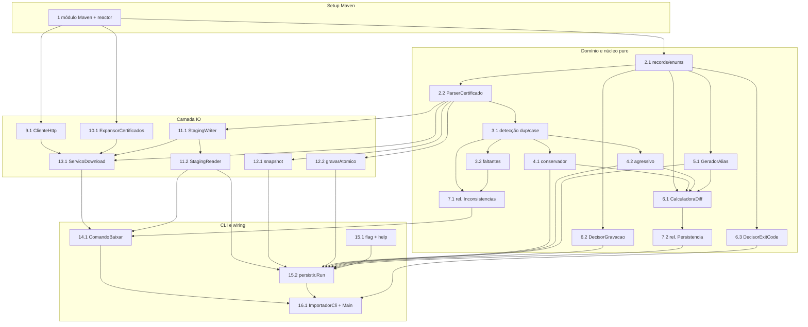

# Implementation Plan: automacao-importador-hardening

## Overview

A implementação (re)cria a ferramenta `automacao-importador` em **Java, integrada ao build Maven** do projeto, substituindo a implementação anterior em Go. A ferramenta é dividida em dois processos independentes (`baixar` e `persistir`), expostos como subcomandos do mesmo binário via **picocli**, e manipula o keystore BKS **nativamente via API do BouncyCastle** (`KeyStore.getInstance("BKS","BC")`, `CMSSignedData`, `CertificateFactory`), eliminando os subprocessos `keytool` e `openssl`.

A estratégia prioriza o **núcleo puro e testável** (pacotes `dominio` e `nucleo`, mais os builders de `relatorio`) com testes **property-based (jqwik)** — mínimo de 100 iterações por propriedade, cada uma marcada com a tag `Feature: automacao-importador-hardening, Property N` — cobrindo as 20 Correctness Properties do design. Só depois entra a camada de IO (`io`: `ClienteHttp`, `ExpansorCertificados`, `StagingReader`/`StagingWriter`, `KeystoreBks`) e, por fim, o wiring da CLI (subcomandos, flags, help) e o dispatcher/`Main`.

A lógica de negócio (regras de deduplicação e detecção de conflito de case por CN, e as fontes de download de PRO/HOM) é **portada do código Go existente** (`diagnostico-cadeia.go` para dedup/conflito de case; `cadeias.go` para as fontes de download), mas **reimplementada em Java nativo**, sem `keytool` nem `openssl`. Cada tarefa constrói sobre as anteriores e termina fazendo o wiring com o dispatcher e os subcomandos, sem código órfão.

## Tasks

- [x] 1. Configurar o módulo Maven `automacao-importador` no reactor
  - Criar o `pom.xml` do módulo (`groupId` `org.demoiselle.signer`, `artifactId` `automacao-importador`), herdando do parent do projeto
  - Sobrescrever `maven.compiler.release` para versão moderna (Java 17+), isolando este módulo do restante do reactor pinado em 1.8
  - Empacotar como **UBER-JAR executável** via **maven-shade-plugin**, com `Main-Class` no manifest e **TODAS as dependências embutidas** (BouncyCastle `bcprov`/`bcpkix`/`bcmail`, `picocli`, Jackson), de modo que a aplicação rode como **APLICAÇÃO AUTÔNOMA** via `java -jar automacao-importador.jar baixar|persistir` em máquina/pipeline **SEPARADO**, **sem depender do reactor Maven em tempo de execução**
  - Declarar dependências: BouncyCastle (`bcprov-jdk18on`, `bcpkix-jdk18on`, `bcmail-jdk18on`), `picocli`, Jackson (`jackson-databind` para `manifest.json`), JUnit 5 (Jupiter) e `net.jqwik:jqwik` para testes property-based; a **versão do BouncyCastle é herdada do parent** (byte-compatível com o signer) mas **empacotada dentro do uber-jar** pelo shade
  - Registrar o módulo `automacao-importador` na lista `<modules>` do `pom.xml` raiz (reactor) **apenas para build**, não para execução
  - Criar a estrutura de pacotes base `org.demoiselle.signer.importador` (`dominio`, `nucleo`, `relatorio`, `io`, `cli`)
  - _Requirements: 1.1_

- [x] 2. Modelos de domínio e parsing X.509 puro (`dominio`, `nucleo.ParserCertificado`)
  - [x] 2.1 Definir os records e enums de domínio
    - Criar no pacote `dominio` os records/enums imutáveis conforme a seção "Data Models" do design: `Origem` (enum PRO/HOM), `Certificado` (com `identidade()`), `Manifest`, `FalhaDownload`, `ResultadoDedup`, `ConflitoResolvido`, `AtribuicaoAlias` (com `renomeado()`), `DiffKeystore`, `MetodoDedup` (CONSERVADOR/AGRESSIVO), `ResultadoExecucao` (com `houveFalha()`)
    - Manter todos os campos puros, sem qualquer dependência de IO
    - _Requirements: 6.4_
  - [x] 2.2 Implementar `ParserCertificado` (parsing puro)
    - Criar `nucleo.ParserCertificado` com função pura que recebe um `X509Certificate` já carregado e produz um `Certificado`: `subject` via `getSubjectX500Principal().getName()`, `serial` via `getSerialNumber()`, `cn` extraído do subject com `javax.naming.ldap.LdapName` (RDN `CN`), `cnNorm = cn.trim().toUpperCase(Locale.ROOT)`, `notBefore`/`notAfter` via `getNotBefore()`/`getNotAfter()`, `selfSigned` comparando subject e issuer
    - Não aplicar nenhum filtro por validade
    - _Requirements: 6.1, 6.2, 6.3_
  - [ ]* 2.3 Escrever testes de exemplo para `ParserCertificado`
    - Testar extração de CN com grafias distintas, cálculo de `cnNorm`, `selfSigned` e preenchimento de datas para certificados válidos e expirados
    - _Requirements: 6.4_

- [x] 3. Detecção de inconsistências e faltantes (`nucleo.DetectorInconsistencias`)
  - [x] 3.1 Implementar detecção de duplicatas exatas e conflitos de case
    - Criar `nucleo.DetectorInconsistencias` com `detectarDuplicatasExatas(certs)` (agrupa por `(serial, subject)`, grupos > 1 são duplicatas) e `detectarConflitosCase(certs)` (agrupa por `cnNorm`, reporta grupos com mais de uma grafia distinta de CN), portando a semântica de `diagnostico-cadeia.go` (ex.: "Hom" vs "HOM")
    - Funções puras sobre `List<Certificado>`, sem IO
    - _Requirements: 3.3, 3.4_
  - [x] 3.2 Implementar cálculo de cadeias HOM faltantes
    - Adicionar `faltantes(esperadas, presentes)` retornando exatamente as fontes HOM esperadas que não estão presentes
    - _Requirements: 3.5_
  - [ ]* 3.3 Property test: detecção de duplicatas exatas correta e completa
    - **Property 1: Detecção de duplicatas exatas é correta e completa**
    - `@Property(tries = 100)` mínimo; tag `Feature: automacao-importador-hardening, Property 1`
    - **Validates: Requirements 3.3**
  - [ ]* 3.4 Property test: detecção de conflitos de case correta e completa
    - **Property 2: Detecção de conflitos de case é correta e completa**
    - `@Property(tries = 100)` mínimo; tag `Feature: automacao-importador-hardening, Property 2`
    - **Validates: Requirements 3.4**
  - [ ]* 3.5 Property test: cálculo de cadeias HOM faltantes
    - **Property 3: Cálculo de cadeias HOM faltantes**
    - `@Property(tries = 100)` mínimo; tag `Feature: automacao-importador-hardening, Property 3`
    - **Validates: Requirements 3.5**

- [x] 4. Deduplicação conservadora e agressiva (`nucleo.Deduplicador`)
  - [x] 4.1 Implementar o método conservador
    - Criar `nucleo.Deduplicador` com `conservador(certs)` que remove apenas duplicatas exatas por `(serial, subject)`, mantendo uma ocorrência por identidade, e **preserva** integralmente os certificados que constituem conflitos de case, retornando `ResultadoDedup` (mantidos + descartadosDuplicata)
    - Nunca descartar por validade
    - _Requirements: 4.4, 4.5, 6.1, 6.2, 6.3_
  - [x] 4.2 Implementar o método agressivo
    - Adicionar `agressivo(certs)` que agrupa por `cnNorm`, mantém um por grupo (o de `notBefore` mais recente; empate no máximo → o de menor índice de entrada) e popula `conflitosCase` (mantido + descartados por grupo)
    - Usar `notBefore` exclusivamente como critério de desempate, nunca como filtro
    - _Requirements: 4.6, 4.7, 4.8, 6.4, 8.3, 8.4_
  - [ ]* 4.3 Property test: método conservador remove exatamente as duplicatas exatas
    - **Property 6: Método conservador remove exatamente as duplicatas exatas e preserva conflitos de case**
    - `@Property(tries = 100)` mínimo; tag `Feature: automacao-importador-hardening, Property 6`
    - **Validates: Requirements 4.4, 4.5**
  - [ ]* 4.4 Property test: método agressivo garante um certificado por CN case-insensitive
    - **Property 7: Método agressivo garante no máximo um certificado por CN case-insensitive**
    - `@Property(tries = 100)` mínimo; tag `Feature: automacao-importador-hardening, Property 7`
    - **Validates: Requirements 4.6, 8.3, 8.4**
  - [ ]* 4.5 Property test: método agressivo seleciona Not_Before mais recente com desempate estável
    - **Property 8: Método agressivo seleciona o Not_Before mais recente com desempate estável**
    - `@Property(tries = 100)` mínimo; tag `Feature: automacao-importador-hardening, Property 8`
    - **Validates: Requirements 4.7, 4.8, 6.4**
  - [ ]* 4.6 Property test: nenhum filtro por validade
    - **Property 9: Nenhum filtro por validade**
    - Gerar certificados expirados e verificar sua permanência após ambos os métodos, salvo descarte por identidade/agrupamento
    - `@Property(tries = 100)` mínimo; tag `Feature: automacao-importador-hardening, Property 9`
    - **Validates: Requirements 6.1, 6.2, 6.3**
  - [ ]* 4.7 Property test: seleção completa da Staging sem duplicatas
    - **Property 20: Seleção completa da Staging sem duplicatas**
    - `@Property(tries = 100)` mínimo; tag `Feature: automacao-importador-hardening, Property 20`
    - **Validates: Requirements 1.5**

- [x] 5. Geração de aliases únicos (`nucleo.GeradorAlias`)
  - [x] 5.1 Implementar `GeradorAlias`
    - Criar `nucleo.GeradorAlias` com `gerarAliases(certs)`: alias base derivado do CN (normalizado para identificador estável); ao colidir case-insensitive com um alias já atribuído, gerar alias alternativo determinístico (base + sufixo derivado do serial; contador estável se ainda colidir) e registrar `aliasOriginal`/`aliasFinal`
    - Garantir determinismo (mesma entrada → mesma saída) e unicidade case-insensitive; retornar `List<AtribuicaoAlias>`
    - _Requirements: 8.1, 8.2, 8.5_
  - [ ]* 5.2 Property test: aliases são únicos case-insensitive
    - **Property 10: Aliases são únicos case-insensitive**
    - `@Property(tries = 100)` mínimo; tag `Feature: automacao-importador-hardening, Property 10`
    - **Validates: Requirements 8.1, 8.5**
  - [ ]* 5.3 Property test: geração de alias determinística e resolve colisões
    - **Property 11: Geração de alias é determinística e resolve colisões**
    - `@Property(tries = 100)` mínimo; tag `Feature: automacao-importador-hardening, Property 11`
    - **Validates: Requirements 8.2**

- [x] 6. Diff, decisão de gravação e exit code puros (`nucleo`)
  - [x] 6.1 Implementar `CalculadoraDiff`
    - Criar `nucleo.CalculadoraDiff` com `calcular(antes, depois, resultadoDedup, atribuicoes)` produzindo `DiffKeystore`: adicionadas = `depois \ antes` por `(subject, serial)`; removidas = `antes \ depois`; descartadas por dedup; conflitos resolvidos; aliases renomeados (final != original); `inalterado = true` quando todos os conjuntos são vazios; quando `antes` é vazio, todas as de `depois` contam como adicionadas
    - _Requirements: 10.2, 10.3, 10.4, 10.5, 10.6, 10.7_
  - [x] 6.2 Implementar `DecisorGravacao`
    - Criar `nucleo.DecisorGravacao` com `deveGravar(nFalhasDownload, temTty, respostaOperador)` retornando true se e somente se `nFalhas == 0`, ou (`nFalhas > 0` e `temTty` e `resposta == "sim"`); default "não"; ausência de TTY força "não"
    - _Requirements: 7.2, 7.3, 7.4, 7.5_
  - [x] 6.3 Implementar `DecisorExitCode`
    - Criar `nucleo.DecisorExitCode` com `codigo(resultado)` retornando 0 sse `nFalhas == 0`, senão != 0, com mensagem identificando o processo (`baixar`/`persistir`) e a quantidade de falhas
    - _Requirements: 9.1, 9.2_
  - [ ]* 6.4 Property test: diff do keystore é simétrico e correto
    - **Property 12: Diff do keystore é simétrico e correto**
    - `@Property(tries = 100)` mínimo; tag `Feature: automacao-importador-hardening, Property 12`
    - **Validates: Requirements 10.2, 10.3**
  - [ ]* 6.5 Property test: decisão de gravação após falhas de download
    - **Property 19: Decisão de gravação após falhas de download**
    - `@Property(tries = 100)` mínimo; tag `Feature: automacao-importador-hardening, Property 19`
    - **Validates: Requirements 7.3, 7.4, 7.5**
  - [ ]* 6.6 Property test: exit code reflete o resultado real
    - **Property 17: Exit code reflete o resultado real**
    - `@Property(tries = 100)` mínimo; tag `Feature: automacao-importador-hardening, Property 17`
    - **Validates: Requirements 9.1, 9.2**

- [x] 7. Montagem pura dos relatórios (`relatorio`)
  - [x] 7.1 Implementar `RelatorioInconsistenciasBuilder`
    - Criar `relatorio.RelatorioInconsistenciasBuilder` (puro) que, a partir do `Manifest`, lista falhas de download (recurso + motivo), duplicatas exatas, conflitos de case e HOM faltantes; quando tudo vazio, emite texto explícito de "sem inconsistências"
    - _Requirements: 3.1, 3.2, 3.3, 3.4, 3.5, 3.6, 7.1_
  - [x] 7.2 Implementar `RelatorioPersistenciaBuilder`
    - Criar `relatorio.RelatorioPersistenciaBuilder` (puro) que, a partir do `DiffKeystore`, lista adicionadas/removidas (subject+serial), descartadas por dedup, conflitos de case resolvidos (mantido + descartados) e aliases renomeados (original + final); quando `inalterado`, emite texto explícito de keystore inalterado; só é construído após gravação bem-sucedida
    - _Requirements: 10.1, 10.2, 10.3, 10.4, 10.5, 10.6, 10.7_
  - [ ]* 7.3 Property test: relatório de falhas de download é fiel
    - **Property 4: Relatório de falhas de download é fiel**
    - `@Property(tries = 100)` mínimo; tag `Feature: automacao-importador-hardening, Property 4`
    - **Validates: Requirements 3.2, 7.1**
  - [ ]* 7.4 Property test: ausência de inconsistências é explícita
    - **Property 5: Ausência de inconsistências é explícita**
    - `@Property(tries = 100)` mínimo; tag `Feature: automacao-importador-hardening, Property 5`
    - **Validates: Requirements 3.6**
  - [ ]* 7.5 Property test: descartes por dedup são relatados fielmente
    - **Property 13: Descartes por dedup são relatados fielmente**
    - `@Property(tries = 100)` mínimo; tag `Feature: automacao-importador-hardening, Property 13`
    - **Validates: Requirements 10.4**
  - [ ]* 7.6 Property test: conflitos de case resolvidos são relatados
    - **Property 14: Conflitos de case resolvidos são relatados**
    - `@Property(tries = 100)` mínimo; tag `Feature: automacao-importador-hardening, Property 14`
    - **Validates: Requirements 10.5**
  - [ ]* 7.7 Property test: renomeações de alias são relatadas
    - **Property 15: Renomeações de alias são relatadas**
    - `@Property(tries = 100)` mínimo; tag `Feature: automacao-importador-hardening, Property 15`
    - **Validates: Requirements 10.6**
  - [ ]* 7.8 Property test: keystore inalterado é explícito
    - **Property 16: Keystore inalterado é explícito**
    - `@Property(tries = 100)` mínimo; tag `Feature: automacao-importador-hardening, Property 16`
    - **Validates: Requirements 10.7**

- [x] 8. Checkpoint — núcleo puro validado
  - Ensure all tests pass, ask the user if questions arise.

- [x] 9. Cliente HTTP com timeout e retry (`io.ClienteHttp`)
  - [x] 9.1 Implementar `ClienteHttp` sobre um `Transporte` injetável
    - Criar `io.ClienteHttp` usando `java.net.http.HttpClient` com `HttpRequest.timeout(Duration.ofSeconds(30))` e um laço de até 3 tentativas por recurso, retornando resultado classificado (sucesso com bytes; falha com motivo: timeout, status != 200, IO)
    - Expor uma interface `Transporte` injetável para permitir mock nos testes de propriedade da lógica de retry
    - _Requirements: 2.3, 7.6_
  - [ ]* 9.2 Property test: retry respeita o limite de tentativas
    - **Property 18: Retry respeita o limite de tentativas**
    - Usar `Transporte` mock que falha em `k` tentativas seguidas; `@Property(tries = 100)` mínimo; tag `Feature: automacao-importador-hardening, Property 18`
    - **Validates: Requirements 2.3, 7.6**

- [x] 10. Expansão de certificados sem subprocessos (`io.ExpansorCertificados`)
  - [x] 10.1 Implementar `ExpansorCertificados`
    - Criar `io.ExpansorCertificados` que expande o ZIP de produção via `java.util.zip.ZipInputStream` e os arquivos `.p7b`/PKCS#7 via `org.bouncycastle.cms.CMSSignedData` + `CertificateFactory.getInstance("X.509")`, retornando `List<X509Certificate>`, substituindo integralmente `openssl`
    - _Requirements: 2.1_
  - [ ]* 10.2 Testes de exemplo para `ExpansorCertificados`
    - Testar expansão de um ZIP e de um p7b contendo múltiplos certificados via BC
    - _Requirements: 2.1_

- [x] 11. Staging: escrita e leitura (`io.StagingWriter`, `io.StagingReader`)
  - [x] 11.1 Implementar `StagingWriter`
    - Criar `io.StagingWriter` que prepara/regrava o layout da staging (`pro/`, `hom/`, `manifest.json` via Jackson), grava cada certificado em DER sob `pro/` ou `hom/` e mantém as entradas de `certificados`, `falhas` e `homEsperadas` no `Manifest`; fontes que falharam permanecem preservadas
    - Nenhuma operação toca o keystore final
    - _Requirements: 2.2, 2.5, 1.4_
  - [x] 11.2 Implementar `StagingReader`
    - Criar `io.StagingReader` que lê `manifest.json` + os certificados referenciados; sinaliza staging vazia quando o manifest não existe ou tem `certificados` vazio
    - _Requirements: 1.5, 1.6_
  - [ ]* 11.3 Testes de exemplo de round-trip da staging
    - Gravar com `StagingWriter` e reler com `StagingReader`, verificando integridade do manifest e dos certificados; testar caso de staging vazia
    - _Requirements: 1.5, 1.6, 2.5_

- [x] 12. Keystore BKS: snapshot, escrita atômica e rollback (`io.KeystoreBks`)
  - [x] 12.1 Implementar `snapshot`
    - Criar `io.KeystoreBks` com `snapshot(path, senha)` que, se o arquivo existe, faz `KeyStore.getInstance("BKS","BC")` + `load(...)`, enumera `aliases()` e para cada um `getCertificate(alias)` → `List<Certificado>` (via `ParserCertificado`); retorna lista vazia se o arquivo não existe (primeira publicação)
    - O caminho do keystore e a senha são recebidos como **parâmetros vindos das opções de CLI** (`--keystore`/`--senha`), nunca de caminho fixo
    - _Requirements: 10.2_
  - [x] 12.2 Implementar `gravarAtomico` com backup e rollback
    - Adicionar `gravarAtomico(atribuicoes, path, senha)`: cria um `KeyStore` BKS/BC em memória, `setCertificateEntry(aliasFinal, cert)` por certificado, escreve com `store()` em `Files.createTempFile`, move o atual para backup e `Files.move(tmp, path, ATOMIC_MOVE)`; em qualquer falha, restaura o backup (rollback) e propaga o erro
    - O caminho do keystore e a senha são recebidos como **parâmetros vindos das opções de CLI** (`--keystore`/`--senha`), nunca de caminho fixo
    - _Requirements: 1.7, 8.1, 8.2, 8.5, 10.8_
  - [ ]* 12.3 Teste de integração: escrita atômica + rollback com KeyStore BC real
    - Usar KeyStore BC real; injetar falha na gravação (`store()`/`move`) e verificar restauração byte-a-byte do backup, snapshot antes/depois e ausência de emissão do `Relatorio_Persistencia`
    - _Requirements: 1.7, 10.8_

- [x] 13. Serviço de download / orquestração de fontes (`io.ServicoDownload`)
  - [x] 13.1 Implementar `ServicoDownload`
    - Criar `io.ServicoDownload` que orquestra PRO (`ACcompactadox.zip` + p7b da TSA) e HOM (listagem HTML → todos os `.p7b`), portando as fontes de `cadeias.go`, usando `ClienteHttp` (timeout+retry) e `ExpansorCertificados`, normalizando via `ParserCertificado` e gravando via `StagingWriter`
    - Nunca filtrar por validade; cada fonte que falha após 3 tentativas ou com conteúdo inválido vira `FalhaDownload` sem interromper as demais (staging preservada)
    - _Requirements: 2.1, 2.4, 2.5, 6.1, 7.1_
  - [ ]* 13.2 Teste de integração: download orquestrado PRO+HOM para a staging
    - Usar `com.sun.net.httpserver.HttpServer` local para simular zip+tsa e a página HTML + p7b de HOM, verificando gravação na staging sem tocar no keystore
    - _Requirements: 2.1, 2.2_

- [x] 14. Subcomando `baixar` (`cli.ComandoBaixar`)
  - [x] 14.1 Implementar `ComandoBaixar`
    - Criar `cli.ComandoBaixar` (picocli) orquestrando: preparar staging, invocar `ServicoDownload`, gravar certificados/falhas/homEsperadas no manifest, montar e emitir o `Relatorio_Inconsistencias` (via `RelatorioInconsistenciasBuilder`) antes de qualquer persistência, reportar a contagem gravada e retornar um `ResultadoExecucao` que o `DecisorExitCode` traduz (0 ou != 0)
    - Expor as opções de CLI `--staging` (diretório de staging, com default sensato) e as opções de URL de origem (`--url-*`) com defaults, reforçando execução **independente do layout do repositório** e como aplicação autônoma
    - Nunca escrever, remover ou alterar o keystore final
    - _Requirements: 1.2, 1.3, 1.4, 2.1, 2.2, 3.1, 6.1, 7.1, 9.1, 9.2_
  - [ ]* 14.2 Testes de exemplo do `baixar`
    - Verificar que `baixar` não cria/modifica o keystore, reporta contagem e sucesso, e que falha de download preserva a staging e reporta erro
    - _Requirements: 1.2, 1.3, 1.4, 2.2_

- [x] 15. Subcomando `persistir` (`cli.ComandoPersistir`)
  - [x] 15.1 Implementar flag `--remover-duplicadas` e ajuda dos métodos
    - Em `cli.ComandoPersistir` (picocli), declarar `@Option(names = {"--remover-duplicadas"})` com default `1` (conservador) e validação para `{1,2}`; valor inválido é rejeitado pelo picocli antes de qualquer gravação, com mensagem de valor inválido
    - Expor também as opções `--keystore` (caminho do BKS de destino), `--senha` (senha do keystore) e `--staging` (diretório de staging), todos com defaults sensatos, além da flag `--remover-duplicadas`, reforçando execução como aplicação autônoma
    - Escrever o texto de `-h`/`--help` descrevendo o Metodo_Conservador (remove só duplicatas exatas; conflitos de case permanecem) e o Metodo_Agressivo (agrupa por CN case-insensitive, mantém Not_Before mais recente, pode descartar certificados distintos de mesmo CN), e documentando as opções `--keystore`, `--senha` e `--staging`; help não baixa, não deduplica nem modifica o keystore
    - _Requirements: 4.1, 4.2, 4.3, 5.1, 5.2, 5.3_
  - [x] 15.2 Implementar o fluxo principal de `persistir`
    - Orquestrar em `ComandoPersistir`: carregar staging (vazia → abortar com "rode baixar primeiro", exit != 0, keystore intacto); `snapshot` ANTES; `Deduplicador` conforme o método; `GeradorAlias` gerando renomeações; `DecisorGravacao` para o fluxo com falhas de download (default "não"; sem TTY via `System.console() == null` → "não"); `KeystoreBks.gravarAtomico`; em falha → rollback e NÃO emitir relatório; em sucesso → `snapshot` DEPOIS, `CalculadoraDiff` e `RelatorioPersistenciaBuilder`; retornar `ResultadoExecucao` para o `DecisorExitCode`
    - _Requirements: 1.5, 1.6, 1.7, 4.4, 4.5, 4.6, 6.2, 6.3, 7.2, 7.3, 7.4, 7.5, 8.1, 8.5, 10.1, 10.8, 9.1, 9.2_
  - [ ]* 15.3 Testes de exemplo do `persistir`
    - Verificar abort com staging vazia, flag inválida sem gravar, default conservador e keystore inalterado emitindo texto explícito
    - _Requirements: 1.6, 4.1, 4.2, 4.3, 10.7_

- [x] 16. Wiring da CLI raiz e Main (`cli.ImportadorCli`)
  - [x] 16.1 Implementar `ImportadorCli` e o `Main`
    - Criar `cli.ImportadorCli` como comando raiz picocli com os subcomandos `baixar` e `persistir` e o `-h`/`--help` global; implementar o `Main` (`Main-Class`) que registra o provider BC (`Security.addProvider(new BouncyCastleProvider())`), executa o `CommandLine` e traduz o `ResultadoExecucao` em exit code via `DecisorExitCode`, chamando `System.exit(codigo)`
    - _Requirements: 1.1, 9.1, 9.2_
  - [ ]* 16.2 Testes de exemplo do dispatcher da CLI
    - Verificar que `baixar`/`persistir` são reconhecidos, que `--help` é exibido sem executar lógica e que os exit codes refletem sucesso/falha
    - _Requirements: 1.1, 9.1, 9.2_

- [x] 17. Checkpoint final — ensure all tests pass
  - Ensure all tests pass, ask the user if questions arise.

## Notes

- Tarefas marcadas com `*` são opcionais (testes property-based, testes de exemplo/integração e refinamentos não essenciais ao comportamento central) e podem ser puladas para um MVP mais rápido; as tarefas de implementação central não são opcionais.
- O design possui seção "Correctness Properties" (20 propriedades), portanto os testes property-based são incluídos como sub-tarefas próximas da implementação, cada um referenciando o número da propriedade e as cláusulas de requisitos que valida.
- Os testes property-based usam **jqwik** integrado ao **JUnit 5 Jupiter**, com mínimo de 100 iterações (`@Property(tries = 100)` ou superior) e a tag `Feature: automacao-importador-hardening, Property N`.
- Os testes de exemplo/edge cobrem wiring, CLI e casos concretos; os testes de integração usam **KeyStore BC real** (atomicidade/rollback, snapshot antes/depois) e **`com.sun.net.httpserver.HttpServer`** local (download orquestrado PRO+HOM), evitando duplicar o que já é coberto por propriedades.
- A lógica de negócio é **portada do código Go existente** (regras de dedup/conflito de case de `diagnostico-cadeia.go`; fontes de download das cadeias de `cadeias.go`), mas **reimplementada em Java nativo via BouncyCastle**, sem `keytool` nem `openssl`.
- O módulo `automacao-importador` sobrescreve `maven.compiler.release` para Java 17+, isolado do restante do reactor pinado em 1.8; é empacotado como JAR executável (`Main-Class`) e participa do ciclo padrão `mvn test`/`mvn verify`.
- A aplicação é **autônoma**, empacotada como **uber-jar** via **maven-shade-plugin** com **todas as dependências embutidas** (BouncyCastle, picocli, Jackson), executável **fora do build do signer** (`java -jar automacao-importador.jar ...`) em máquina/pipeline separado; os caminhos e parâmetros (keystore, senha, staging, URLs de origem) são **configuráveis por opções de CLI com defaults sensatos**.
- Cada tarefa referencia os requisitos que atende para rastreabilidade completa.

## Task Dependency Graph

```json
{
  "waves": [
    { "id": 0, "tasks": ["1"] },
    { "id": 1, "tasks": ["2.1", "9.1", "10.1"] },
    { "id": 2, "tasks": ["2.2", "2.3", "9.2", "10.2"] },
    { "id": 3, "tasks": ["3.1", "3.2", "5.1", "6.2", "6.3", "11.1"] },
    { "id": 4, "tasks": ["3.3", "3.4", "3.5", "4.1", "4.2", "5.2", "5.3", "6.6", "11.2", "12.1"] },
    { "id": 5, "tasks": ["4.3", "4.4", "4.5", "4.6", "4.7", "6.1", "6.5", "11.3", "12.2"] },
    { "id": 6, "tasks": ["6.4", "7.1", "7.2", "12.3", "13.1"] },
    { "id": 7, "tasks": ["7.3", "7.4", "7.5", "7.6", "7.7", "7.8", "13.2", "14.1"] },
    { "id": 8, "tasks": ["14.2", "15.1"] },
    { "id": 9, "tasks": ["15.2"] },
    { "id": 10, "tasks": ["15.3", "16.1"] },
    { "id": 11, "tasks": ["16.2"] }
  ]
}
```

### Visualização das dependências (mermaid)


